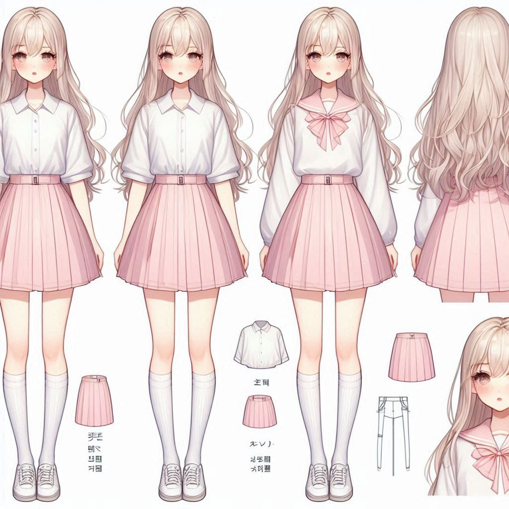
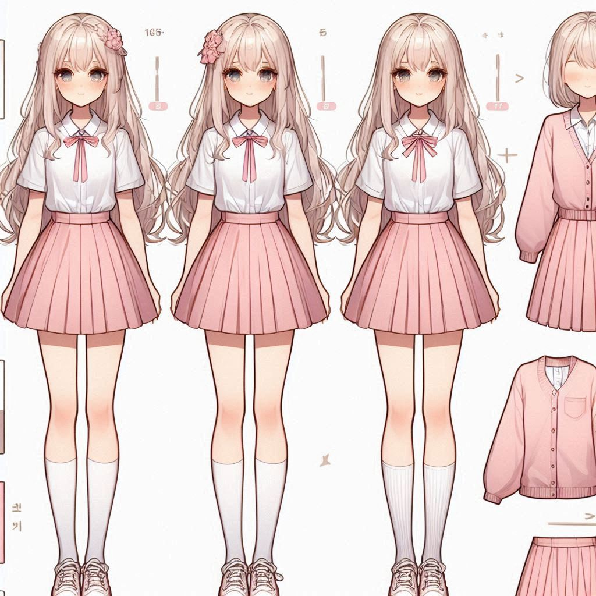
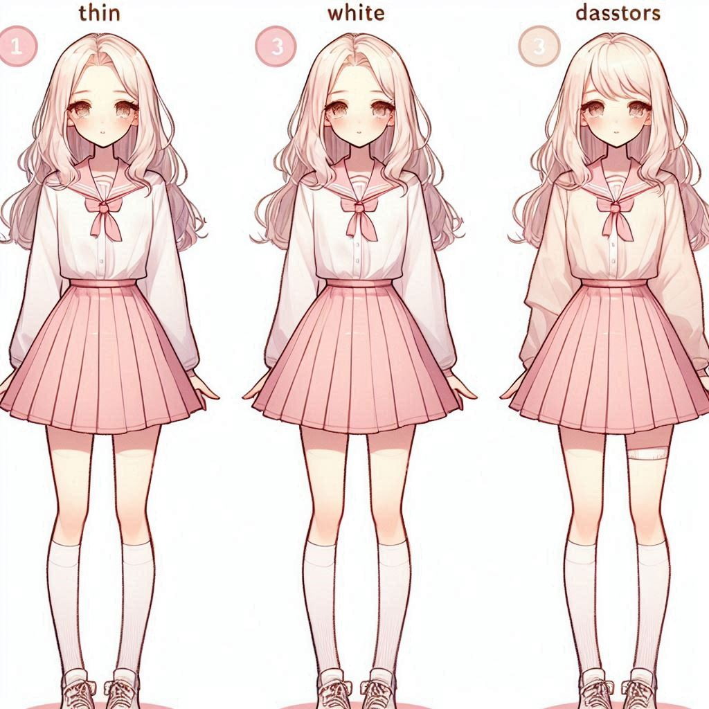
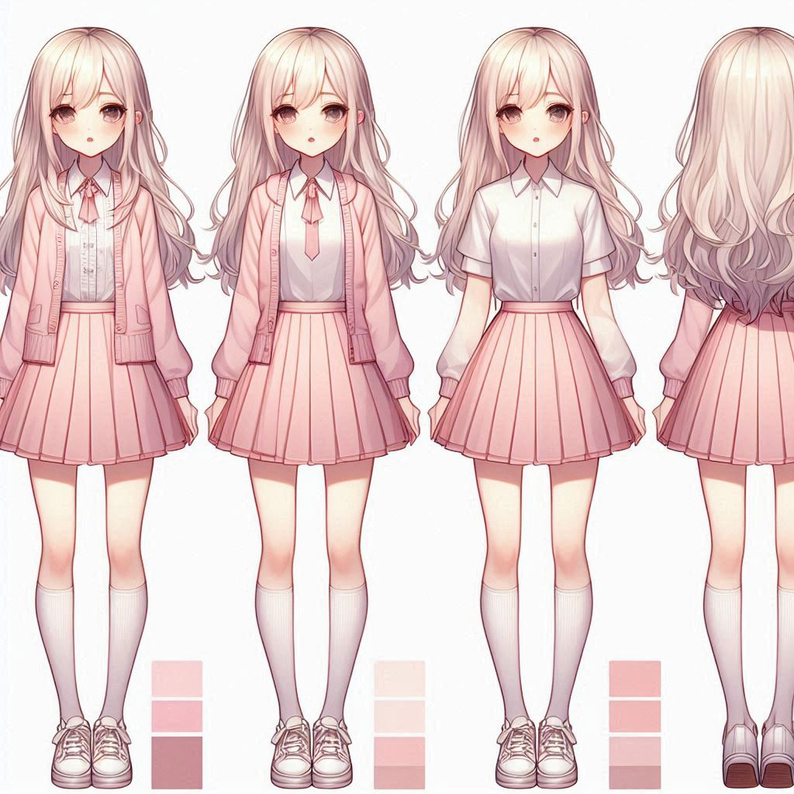
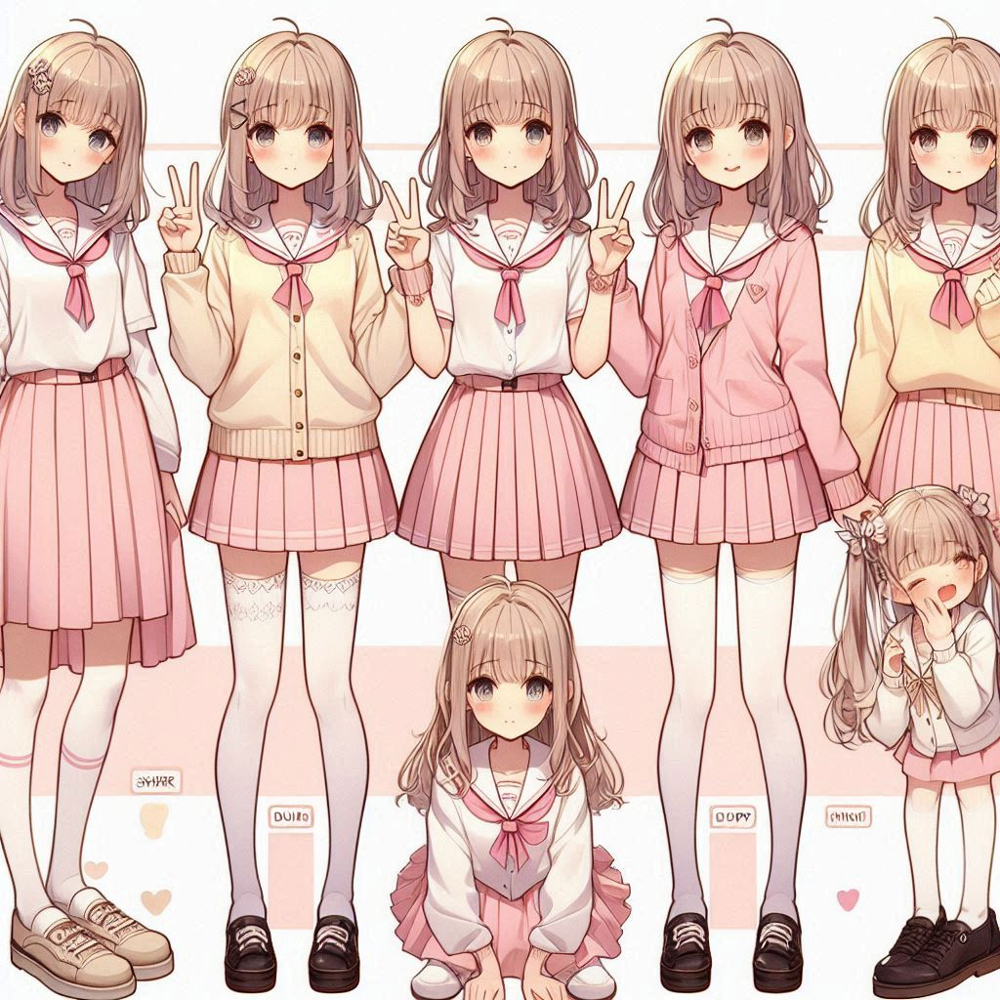
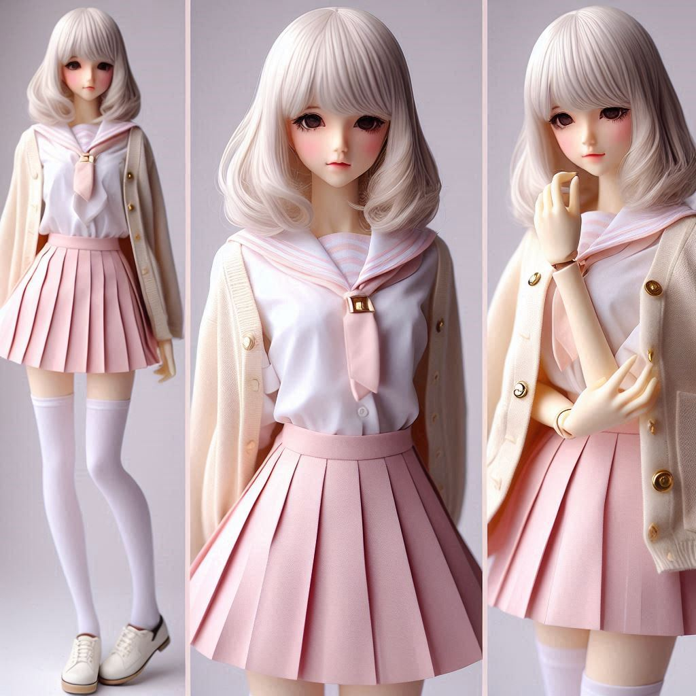
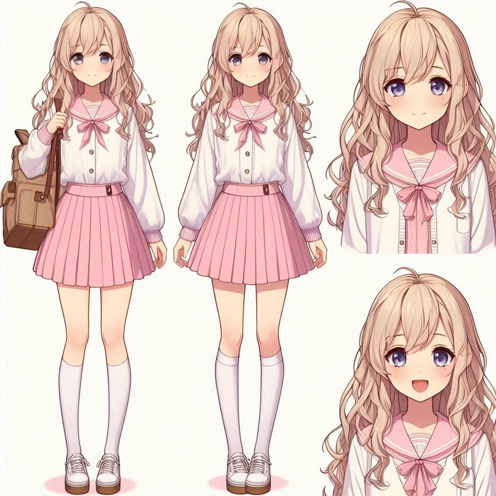
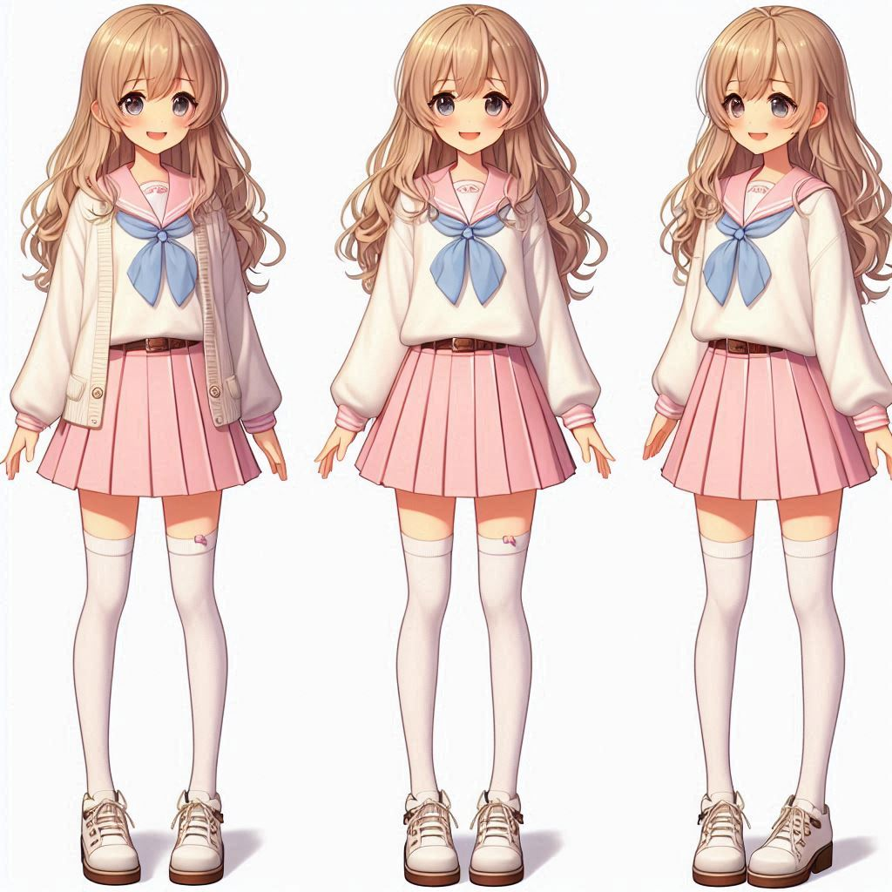
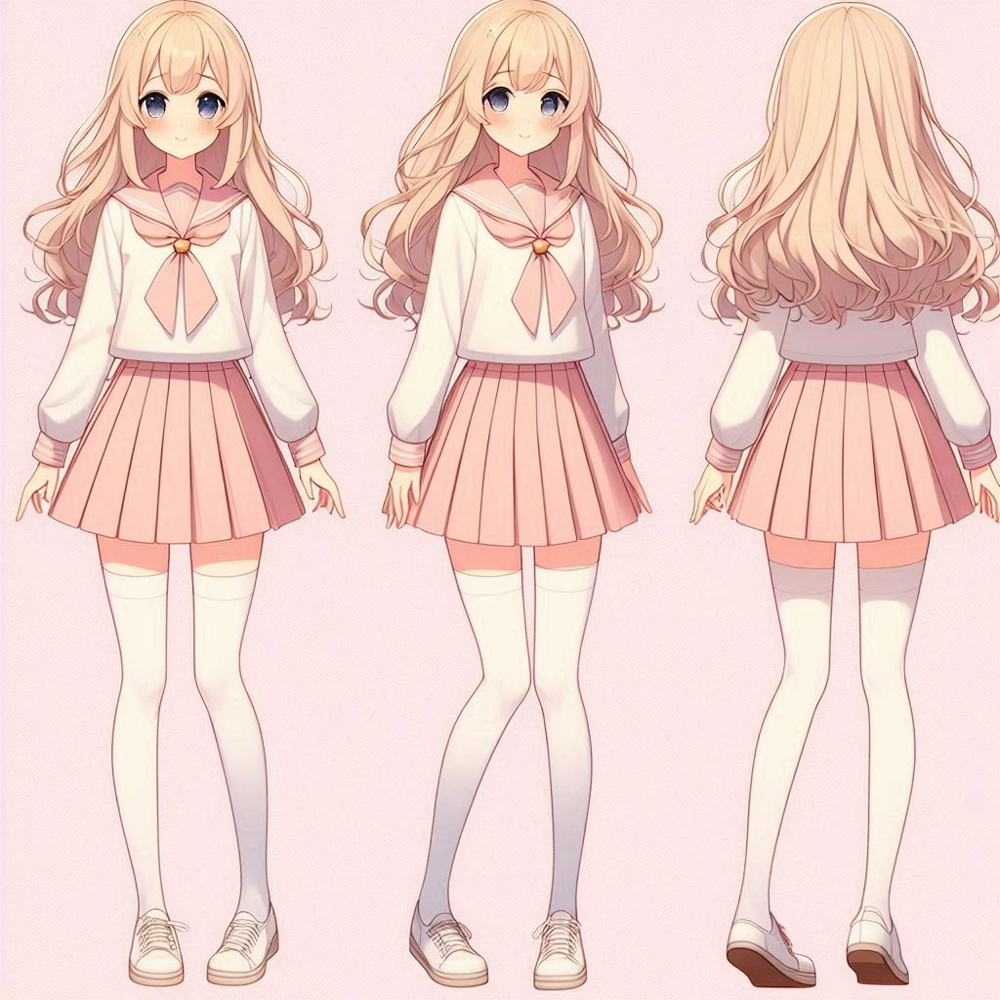

## 2024-06-04

目前的喜好如下

## 喜好

### 颜色

淡粉色、白色

黑色

### 形象

17岁高中女生

身高165~175之间

偏小的脸

皮肤偏白一些即可。

白色（或者黄带金色）长发，及肩，微卷。

脸不要太圆，偏学生相貌

露出膝盖的百褶裙

类似校服的衬衣、可以有轻薄的外套

刚刚过膝盖的白丝袜

可爱风格的小皮鞋（黑色、白色、粉色）、或者简单的有点亮晶晶的低跟（类似于礼服的那种鞋）

手腕有可爱的亮闪闪的手饰。

### 气质

喜欢笑、有活力。

## 参考图

喜欢：脸4、头发除了刘海4、第三个衣领3、前两个衣领3

不喜欢：裙子1、所有衣服1、鞋子2

喜欢：发饰3、上衣3、外套3

不喜欢：裙子2、鞋子2、衣领1

喜欢：刘海3、发型3、第三个袖子作外套还行，

不喜欢：表情1、脸1、鞋子1、衣领2、

喜欢：发型4、前两个的外套4、第二个的上衣3、

不喜欢：脸1、鞋子1

喜欢：第二的外套3、第四的外套4（解开扣子应该会更好）、

不喜欢：领口2、脸1、鞋1

喜欢：外套4、鞋3、白丝（有点高了）3

不喜欢：裙子1、领口1、外套的扣子1、头发1、脸1、

喜欢：脸3、

不喜欢：发型（过于卷了）1、

喜欢：发型（看起来有点往两侧蓬了？）4、白丝4、第三个鞋子3

不喜欢：领口1、表情1、发色1、

喜欢：鞋4、袖子4、

不喜欢：发量有点过多了1、表情2、领口2、

## 背景设定

 

## 具体描述
