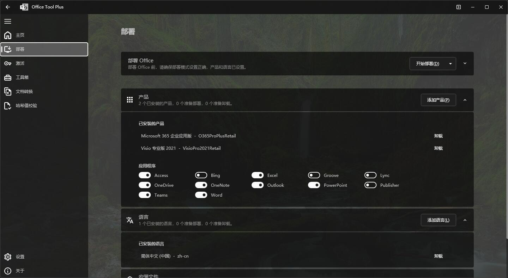
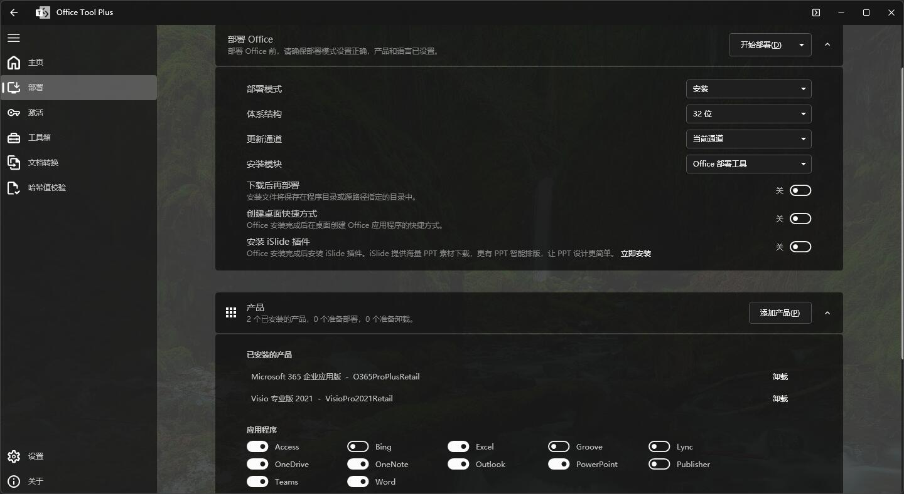
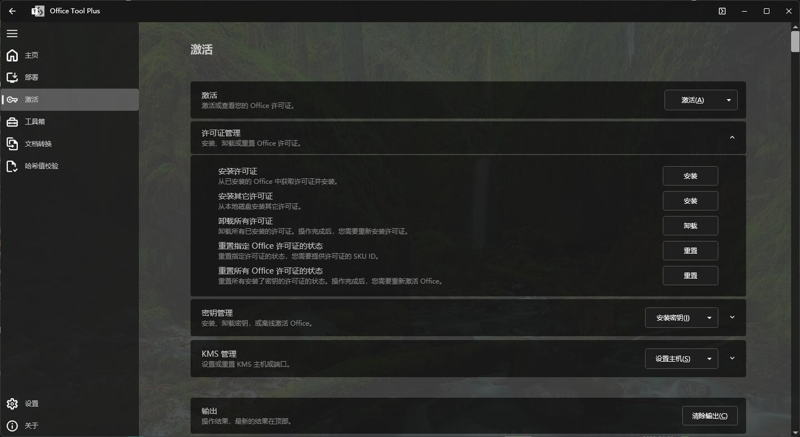

## 所用的软件

[Office Tool Plus](https://otp.landian.vip/zh-cn/)选择框架版（有.NET6.0的可以使用无框架的版本）。

## 安装

打开Office Tool Plus，进入`部署`选项页。

点击`添加产品`，选择所需的软件版本，我选择了office365企业应用版（但我用的是我微软账户的2019家庭学生版，所以这项其实可以选2019家庭学生版）与visio专业版2021（这是我写论文所需）。

添加完成后，在下方选择需要的应用，不需要就关闭选项即可。

在部署Office中打开`下载后再部署开关`，其他都不修改。

点`开始部署`，等待软件自己安装完成。

##  激活

进入`激活`选项页。

先清除已有的许可证。

我微软账户有office2019家庭学生，所以word四件套我直接登录账号即可。

点击`安装许可证`，选择visio专业版2021（和上面安装的版本一致），等待其运行完成即可。

## 完成

这个软件有新手帮助，出问题可以直接寻找。
